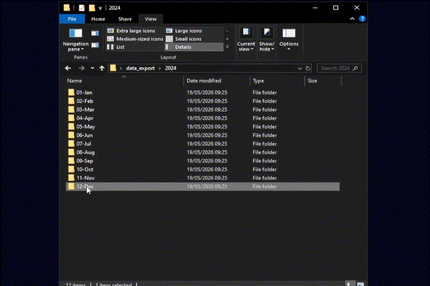
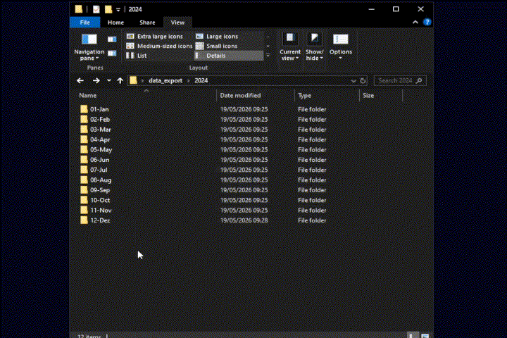
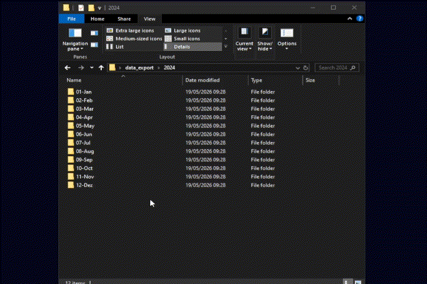
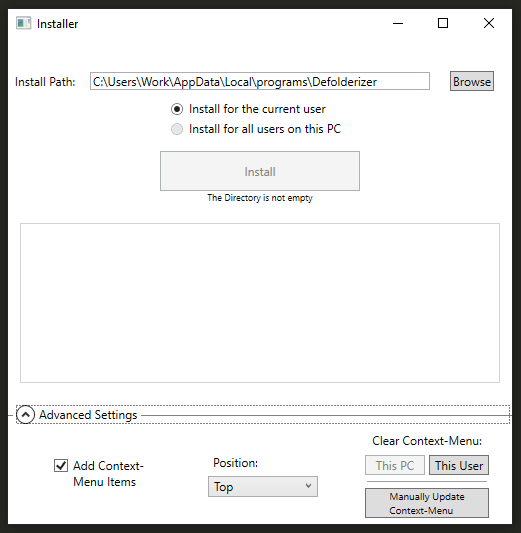

# Defolderizer

An automated desktop utility to quickly **move files out of folders** and instantly flatten **deeply nested folder structures** with **just two clicks**.

  
   
  

## Table of Contents

1. [Features](#features)
1. [Installing](#installing)
1. [Technichal Implementation](#technical-implementation)
1. [Known Issues](#known-issues)
1. [RoadMap](#roadmap)

## Features

After installing right-clicking on folders will show 3 new options:

 - **Unfold:** Move all files out of the selected folder and delete the empty folder if possible.
 
 - **Defolderize:** Unfold all folders inside selected folder.

 - **Defolderize Recursive:** Recursively unfold all folders inside selected folder, until there are no folders left. (Displays a confirmation dialog to prevent unintentional execution)

If some files arent accessable, a **message** will pop up at the end listing **all files** that could not be moved and why.

**Logfiles** are provided to help with **troubleshooting** and submiting **bug reports**.   
Next to the normal Logs, theres also a DeveloperLog file, with all the **user data** like filenames and paths **removed**, if you aren't comfortable with sharing data like this.

## Installing

Download the latest version from **Releases** and run the Installer.

It provides options for: 
- Install location
- Install scope(current user/ all users)
- positioning of the items in the context menu

And ways to manually add/remove the items to the context menu.

## Technical Implementation

**Robust Exception Handling and Logging:** 
Permission errors and locked/missing files are cleanly handled, **logged** for **user feedback** and **log files** and the program exits cleanly **without crashing**.

**Service-Centric Approach:**  
Code is logically separated into **Services** and **Models**.

**Dependency Injection & Inversion:** 
**Interfaces** and **DI** are implemented to enable De-Coupling and **Dependency Inversion**.

**Seperation of UI and Logic(Installer):** 
**UI(WPF)** and **Business Logic** are cleanly seperated and make use of **Data Bindings**.

**Tests:** 
Some critical functionality is **Unit- and Integration-Tested** to enable stable refactoring.

## Known Issues
- Folders inside or copied out of some **Cloud-Storage-Providers** like Dropbox or MegaSync cause errors when deleting the empty folders due to some permission settings on these folders

## Roadmap
- Ability to configure the tool via **config file**(Logfile location, enable/disable Recursive Defolderize warning ect..)
- "Forbidden Folders"; places the tool is not allowed to act in, for example **"C:\\Windows"**
- Option to **group** context menu items in a **sub-menu**
- **Uninstall** 
- **UNDO** Feature
